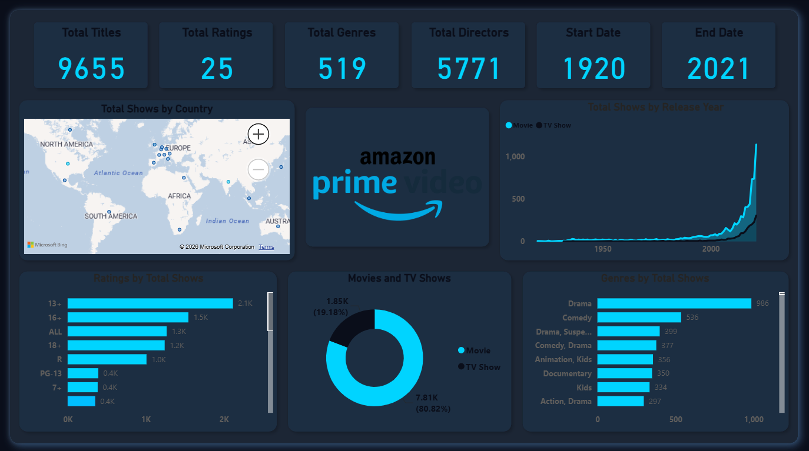

# 🎬 Amazon Prime Video Dashboard | Power BI



## 📌 Overview

An interactive Power BI dashboard analyzing **Amazon Prime Video's content library** from 1920 to 2021. This project explores trends across movies and TV shows, covering ratings, genres, directors, and global content distribution — delivering clear visual insights into one of the world's largest streaming platforms.

---

## 🎯 Objectives

- Analyze the growth of Amazon Prime Video's content catalog over a century
- Identify top-performing genres, ratings distributions, and content types
- Visualize global content availability by country
- Compare the split between Movies and TV Shows

---

## 📊 Key Metrics

| Metric | Value |
|---|---|
| Total Titles | 9,655 |
| Total Ratings | 25 |
| Total Genres | 519 |
| Total Directors | 5,771 |
| Content Period | 1920 – 2021 |

---

## 📈 Dashboard Features

- **KPI Cards** — Quick snapshot of total titles, ratings, genres, directors, and date range
- **Total Shows by Country** — World map visual showing geographic content distribution
- **Total Shows by Release Year** — Line chart tracking content growth over time (Movies vs TV Shows)
- **Ratings by Total Shows** — Horizontal bar chart breaking down content by age rating
- **Movies vs TV Shows** — Donut chart showing the content type split (80.82% Movies, 19.18% TV Shows)
- **Genres by Total Shows** — Bar chart ranking the most popular genres (Drama leads with 986 titles)

---

## 🛠️ Tools & Technologies

| Tool | Purpose |
|---|---|
| **Power BI Desktop** | Dashboard development and data visualization |
| **Microsoft Bing Maps** | Geographic visualization |
| **CSV (Kaggle Dataset)** | Data source |

---

## 📁 Dataset

- **Source:** [Kaggle — Amazon Prime Movies and TV Shows](https://www.kaggle.com/datasets/shivamb/amazon-prime-movies-and-tv-shows)
- **File:** `amazon_prime_titles.csv`
- **Records:** 9,655 titles
- **Fields include:** Title, Type, Director, Cast, Country, Date Added, Release Year, Rating, Duration, Genre, Description

---

## 🚀 Getting Started

1. **Clone this repository**
   ```bash
   git clone https://github.com/minhaj-313/Amazon-Prime-Video-Dashboard-Using-PowerBi.git
   ```

2. **Download Power BI Desktop**
   - [Download here](https://powerbi.microsoft.com/desktop/)

3. **Open the dashboard**
   - Launch Power BI Desktop
   - Open `Amazon_Prime_Video_Dashboard.pbix`
   - Interact with filters and visuals

---

## 💡 Key Insights

- **Drama** is the dominant genre with 986 titles, followed by Comedy (536)
- **Movies** make up over 80% of the entire catalog
- Content availability saw a **massive spike post-2000**, with peak growth in the 2010s
- The **13+ rating** category has the highest number of titles (2.1K), indicating a focus on teen and adult content
- The platform hosts content from directors across **100+ countries**

---

## 📂 Project Structure

```
📦 Amazon-Prime-Video-Dashboard
 ┣ 📊 Amazon_Prime_Video_Dashboard.pbix   # Power BI dashboard file
 ┣ 📄 amazon_prime_titles.csv             # Raw dataset
 ┣ 🖼️ Amazon_Prime_Video_Dashboard_by_Shaikh_Minhaj.png  # Dashboard preview
 ┣ 🖼️ Amazon-Prime-Video-Logo.png         # Brand logo
 ┗ 📝 README.md                           # Project documentation
```
